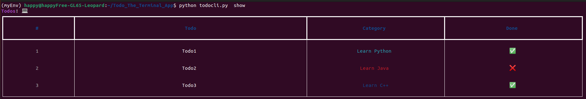

# Todo_The_Terminal_App

This is Todo Tracker for command line interface. It is built using rich, Typer and Sqlite3. 

### Requirements:
1. Python>=3.3

    install [python](https://www.python.org/downloads/)

2. Rich Library

    ```pip install rich```

3. Typer Library
 
    ```pip install Typer```

### Commands

1. Help

   ```python todocli.py --help```
   
   
    

2. <command> help

    ```python todocli.py <COMMAND> --help```


    

### CURD Operations

2. Add 

    ```python todocli.py add <TASK> <CATEGORY>```


    

2. Show

    ```python todocli.py show```


    

4. Update

    ```python todocli.py update <POSITION> <TASK> <CATEGORY>```


    

6. Delete

    ```python todocli.py delete <POSITION>```


    


Note: Command ```show``` works fine for unix/linux operating systems but may face issues in displaying done column in windows.


